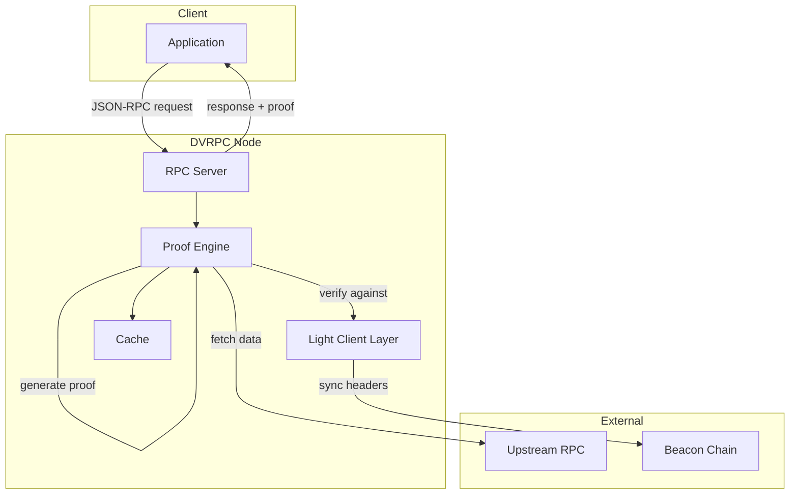
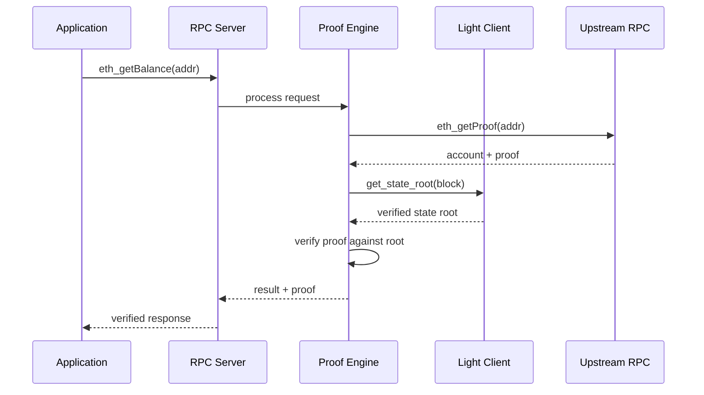
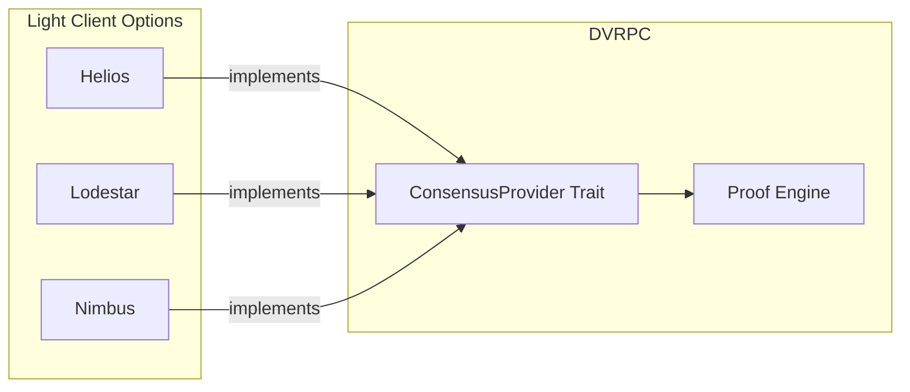
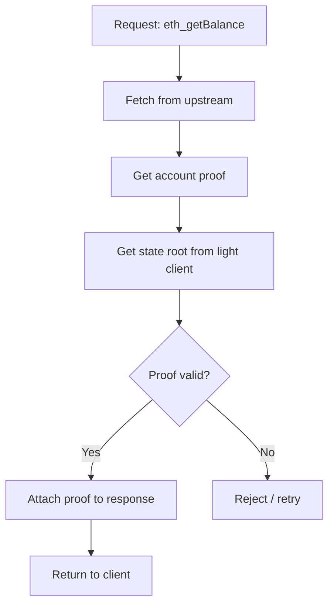

# Architecture Diagrams

> **Note:** These diagrams represent the planned architecture.

## System Overview

```mermaid
flowchart TB
    subgraph Client
        APP[Application]
    end

    subgraph DVRPC["DVRPC Node"]
        RPC[RPC Server]
        PE[Proof Engine]
        LC[Light Client Layer]
        CACHE[Cache]
    end

    subgraph External
        UPSTREAM[Upstream RPC]
        BEACON[Beacon Chain]
    end

    APP -->|JSON-RPC request| RPC
    RPC --> PE
    PE -->|fetch data| UPSTREAM
    LC -->|sync headers| BEACON
    PE -->|verify against| LC
    PE -->|generate proof| PE
    PE --> CACHE
    RPC -->|response + proof| APP
```

## Request Flow

```mermaid
sequenceDiagram
    participant App as Application
    participant RPC as RPC Server
    participant PE as Proof Engine
    participant LC as Light Client
    participant Up as Upstream RPC

    App->>RPC: eth_getBalance(addr)
    RPC->>PE: process request
    PE->>Up: eth_getProof(addr)
    Up-->>PE: account + proof
    PE->>LC: get_state_root(block)
    LC-->>PE: verified state root
    PE->>PE: verify proof against root
    PE-->>RPC: result + proof
    RPC-->>App: verified response
```

## Light Client Integration

```mermaid
flowchart LR
    subgraph LightClients["Light Client Options"]
        H[Helios]
        L[Lodestar]
        N[Nimbus]
    end

    subgraph DVRPC
        CP[ConsensusProvider Trait]
        PE[Proof Engine]
    end

    H -->|implements| CP
    L -->|implements| CP
    N -->|implements| CP
    CP --> PE
```

## Proof Generation

```mermaid
flowchart TD
    REQ[Request: eth_getBalance] --> FETCH[Fetch from upstream]
    FETCH --> PROOF[Get account proof]
    PROOF --> ROOT[Get state root from light client]
    ROOT --> VERIFY{Proof valid?}
    VERIFY -->|Yes| ATTACH[Attach proof to response]
    VERIFY -->|No| REJECT[Reject / retry]
    ATTACH --> RETURN[Return to client]
```
