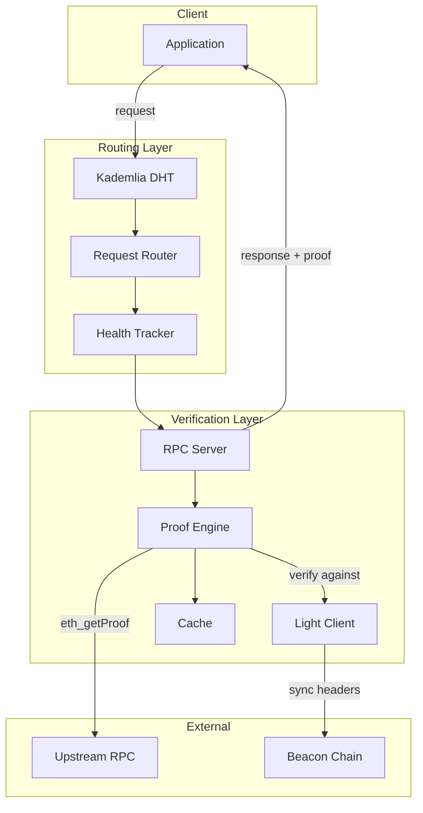
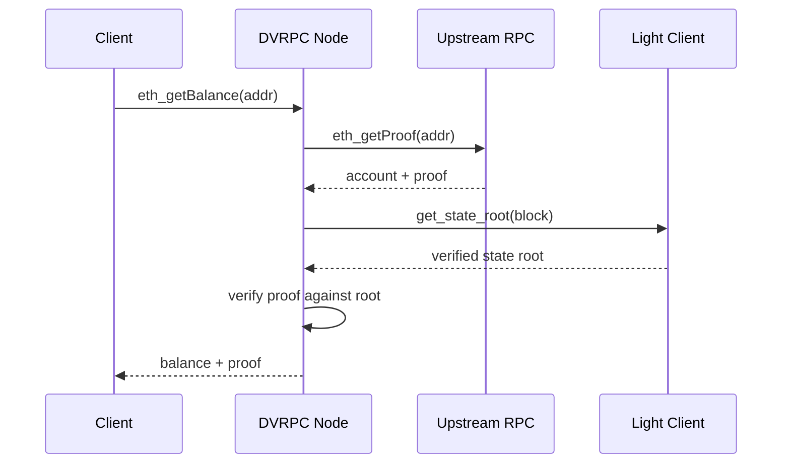
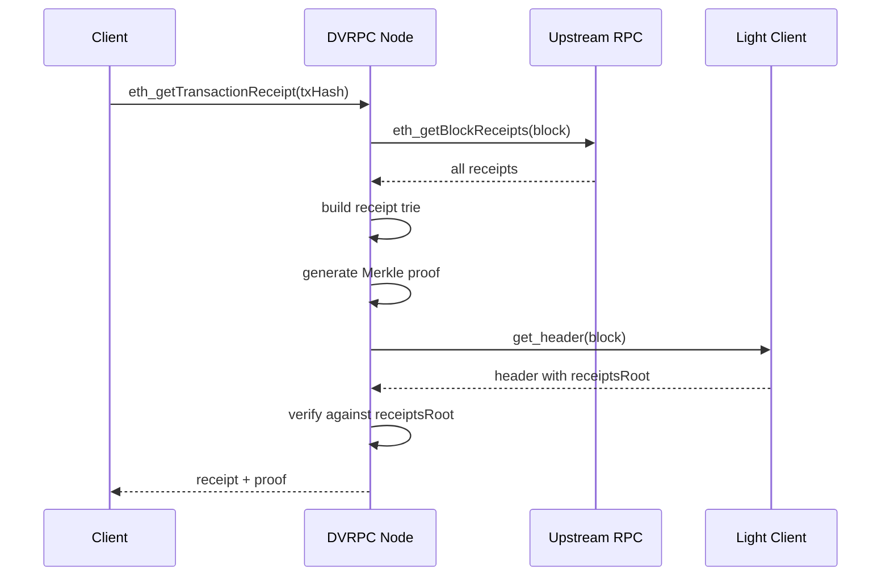
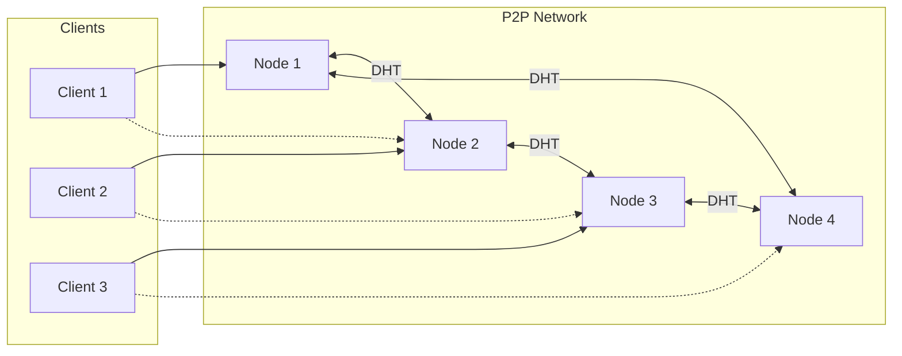
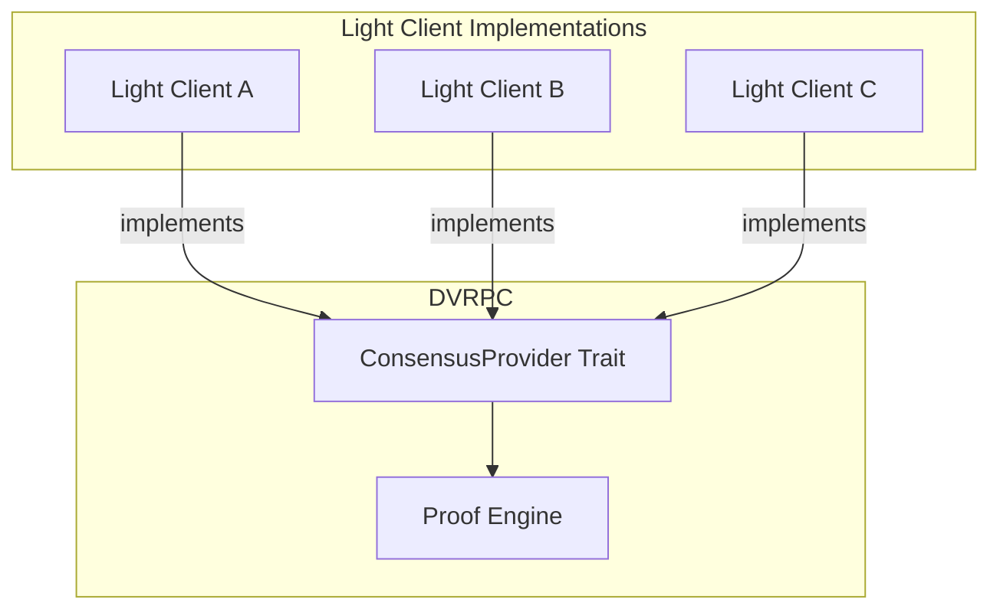
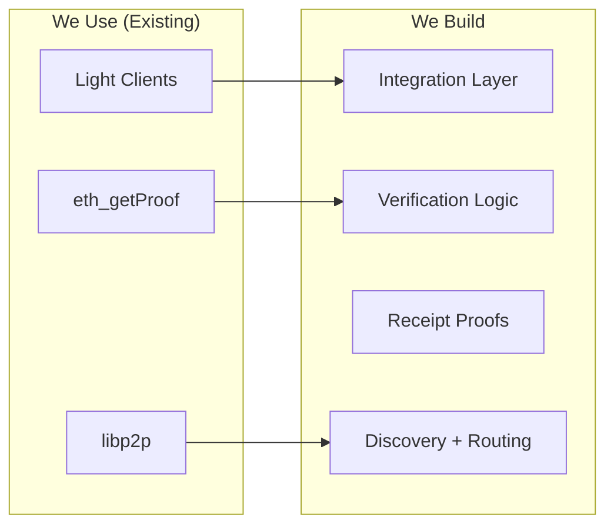

# Architecture Diagrams

> **Note:** These diagrams represent the planned architecture.

## Two-Layer Architecture

## State Proof Flow (EIP-1186)

## Receipt Proof Flow (Our Implementation)

## P2P Routing Layer

## Light Client Integration (Pluggable)

## What We Use vs What We Build

