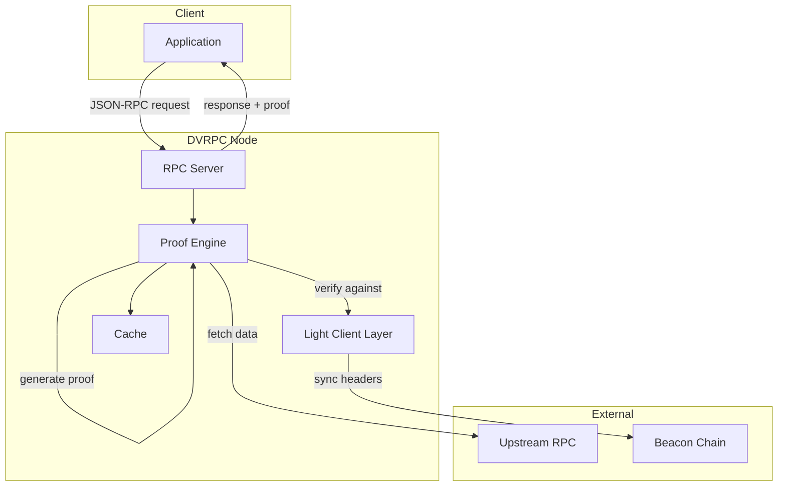

# Architecture

> **Note:** This describes the planned architecture.

## Design Principle

DVRPC won't reinvent consensus verification. It will use existing, battle-tested light client implementations and focus on what's missing: proof generation and decentralized access.

## Planned Components

### 1. Light Client Layer

Pluggable integration with existing light clients. Will provide verified block headers and state roots without running a full node. See [Light Clients](light-clients.md) for details.

### 2. Proof Engine

Will generate cryptographic proofs for responses:
- EIP-1186 state proofs for account and storage queries
- Receipt trie proofs for transaction receipts

### 3. RPC Server

Standard Ethereum JSON-RPC interface. Will be compatible with existing tools and libraries (ethers.js, web3.js, etc.).

### 4. P2P Network (Future)

- Node discovery
- Header gossip
- Decentralized request routing

## Planned Request Flow

```
Request → RPC Server → Fetch from upstream
                     → Verify against light client state root
                     → Generate/attach proof
                     → Return verified response
```

1. Client sends JSON-RPC request
2. RPC server fetches data from upstream provider
3. Response verified against light client's state root
4. Merkle proof generated and attached
5. Verified response returned to client

## Diagram



See [diagrams/architecture.md](../diagrams/architecture.md) for more diagrams.
