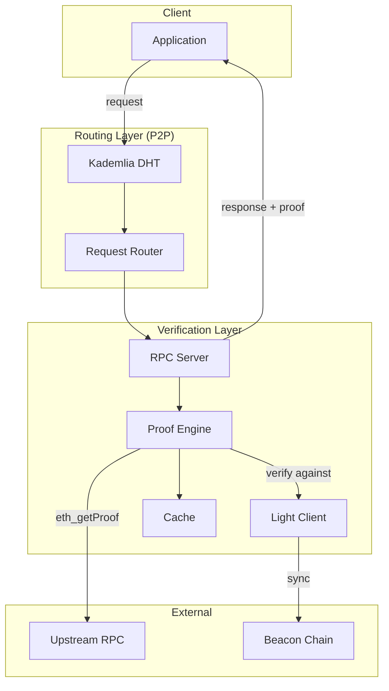

# Architecture

> **Note:** This describes the planned architecture.

## Design Principle

DVRPC won't reinvent consensus verification. It will use existing light client implementations and focus on what's missing: proof generation, verification, and decentralized access.

## Two Layers

DVRPC consists of two distinct layers:

### 1. Verification Layer

Handles data verification and proof generation:
- Integrates with existing light clients (pluggable)
- Verifies proofs against light client's state root
- Generates receipt proofs (no standard RPC exists for this)
- Returns verified data with proofs to clients

### 2. Routing Layer

Handles decentralized request distribution:
- P2P node discovery via Kademlia DHT
- Request routing across network nodes
- Health and availability tracking
- No central point of failure

**Important:** The P2P layer is for routing, not consensus. Each node's light client handles consensus independently.

## What We Use vs What We Build

| Component | We Use (Existing) | We Build |
|-----------|-------------------|----------|
| Light client | Existing implementations | Integration layer |
| State proofs | `eth_getProof` (EIP-1186) | Verification logic |
| Receipt proofs | — | Full implementation |
| P2P networking | libp2p | Discovery + routing |

## Planned Components

### Light Client Integration

Pluggable integration with existing light clients. Will provide verified state roots without running a full node. See [Light Clients](light-clients.md) for details.

### Proof Engine

- **State proofs:** Call `eth_getProof` on upstream, verify against light client's state root
- **Receipt proofs:** Fetch block receipts, build trie, generate Merkle proof (no RPC exists for this)

### RPC Server

Standard Ethereum JSON-RPC interface. Will be compatible with existing tools (ethers.js, web3.js, etc.).

### P2P Network

- **Node discovery** - Nodes find each other via Kademlia DHT
- **Request routing** - Client requests distributed across network
- **Health tracking** - Know which nodes are available
- **No central point** - Decentralized access

See [P2P Architecture](p2p.md) for details on why P2P is for availability, not verification.

## Planned Request Flow

```
Client Request
    ↓
P2P Routing → Select available node
    ↓
RPC Server → Receive request
    ↓
Proof Engine → Fetch from upstream
             → Verify against light client state root
             → Generate/attach proof
    ↓
Response with proof → Client
```

## Diagram



See [diagrams/architecture.md](../diagrams/architecture.md) for more diagrams.
